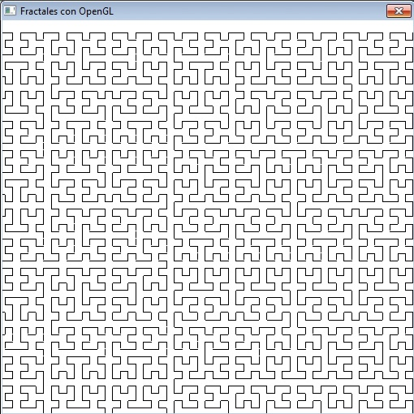

# Fractales en C

Este repositorio contiene implementaciones en C para generar diferentes tipos de fractales. Los fractales son estructuras geométricas complejas que se repiten a diferentes escalas. Estos algoritmos permiten visualizar algunos de los fractales más conocidos.

## Contenido

- **Código fuente**: Implementación de los fractales en C.
- **Imágenes**: Ejemplos de fractales generados con el código en este repositorio.

## Ejemplos de fractales

Aquí puedes ver algunas de las imágenes generadas:

